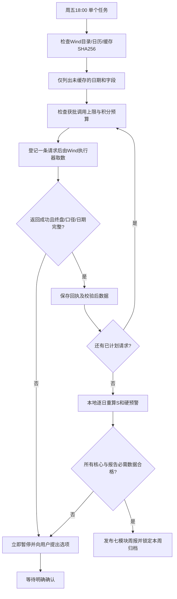

# A股情绪指数公式说明书

版本：**v1.1.0**。更新日期：2026-09-16。唯一生产数据源：**Wind Alice 万得金融数据**。

本次仅迁移数据获取和执行控制，保留v1.0.0六因子、权重、归一化、时间约束、状态分区与全部预警条件。主要变化是：用经过口径核验的历史预聚合序列替代逐股回溯，每周一次补取新增交易日，在本地重算日度分数及周内风险；异常时停止付费调用和正式报告，等待用户确认。

**实施状态：文档、Wind专用本地计划/缓存/计算控制脚本已更新；当前会话没有可调用的Wind Alice连接器，所提供材料只有35项工具功能说明，没有完整参数schema、实际指标目录、积分价表或历史覆盖证明。本次没有调用Wind、没有产生Wind积分消耗，也没有生成新的Wind实测周报。** 实际连接器执行及字段口径验收仍需在Wind环境完成；不能把这里的本地标准字段名称直接当成Wind API字段。

## 1. 执行规范（按要求原文纳入）

> 执行时间：每周五 18:00（收盘后），盘中数据一律禁用；当日收盘未完成时则暂停生成报告，并向我进行询问。
>
> 数据源：强制使用 Wind Alice 万得金融数据，未经我书面同意不得切换或混用。
>
> 异常处理：
>
> a. 若取数返回为空、积分不足或其他问题，第一时间暂停报告生成，绝不用替代值硬算；
>
> b. 主动与我沟通，说明异常的具体位置（数据源/表/字段/日期）；
>
> c. 提供多个解决方案及利弊说明（至少两个选项）；
>
> d. 必须经我确认后才能继续执行；
>
> e. 严禁自行决定关键问题（包括但不限于：更换数据源、修改权重/阈值/窗口、填补或估算缺失值）。

上述规范同时约束执行器、数据转换层、计算脚本和报告发布层。脚本打印并保存异常询问单，实际Wind执行器必须立即把询问展示给用户，不能只写后台日志后继续。确认文件只是确认事实的审计记录，不是让代理自行填写`true`获得授权。

周五18:00是**北京时间**。只到达18:00并不证明收盘数据已经最终完成：返回数据还须为已确认终盘且符合报告时点可得性的记录。周五为休市日时，依Wind交易日历使用本周实际最后交易日；日历不全、整周无交易或终盘状态不明均暂停询问。错过时点后的补跑、历史回放也不能自行执行，需针对该计划取得确认。

这里规定周频任务如何执行，**没有为当前账号创建定时任务或连接Wind账户**。部署时由一个已配置的周五18:00调度器触发，避免多个客户端各自启动一份任务。

## 2. 本次改变与保持不变的内容

| 层次 | v1.1.0处理 |
|---|---|
| 数据源 | 删除生产脚本中的公网HTTP抓取、备用源与混源路径；只接受Wind回执及其独立缓存 |
| 取数粒度 | 优先原生全市场历史预聚合序列；原生没有等价指标时，评估Wind服务端聚合，先确认口径和费用 |
| 运行频率 | 每周五一次；一次取得本周全部新增日频记录，不进行日频或盘中轮询 |
| 计算 | 原始日频输入、本地六因子、本地756日半秩归一化，公式不变 |
| 预警 | 情绪分与硬价格条件独立检查；周内逐日重算并保留全部事件，不只检查周五 |
| 缺失 | 计算层保持S=NA；执行层立即暂停正式报告并询问，不用价格参考分P替代发布 |
| 历史 | 同源已验证Wind缓存复用；非Wind旧数据只归档，不进入新版计算 |
| 成本 | 缓存命中不调用、缺口按日期补取、请求先登记、未知结果不重发、报价未知不付费试探 |

旧版东财/腾讯/新浪的日线、快照、P=21.16和历史复盘结果不是Wind结果；本版不沿用它们作为当前实测结果。“历史已核验必须缓存”指允许复用的**同源Wind数据**。旧来源数据保留审计价值，但不能通过改文件名或把`source`改为Wind进入生产库。

## 3. 模型定义：完全保留

### 3.1 股票池、单位与时点

个股统计池仍为沪深A股、当日非ST/*ST、非退市整理、上市至少60个交易日，排除当日无涨跌幅限制等特殊交易状态；必须使用当时状态并包含后来退市的股票。停牌股不当作平盘。北交所、ST和新股仍为独立扩展范围，不因Wind默认“全A”定义不同而自动纳入。

价格基准仍为**中证全指000985价格指数**，不换成万得全A、上证综指或沪深300。实际Wind实体标识应从Wind目录核验，本文不猜测代码后缀。基准成分与沪深非ST成熟股票池的范围差异保持原版设计，并非迁移后新加的口径。

收益和比例在程序中用小数，-3%为-0.03；金额均为人民币元。个股收益校正除权除息；均线采用同一除权口径。停牌价格仅能依经过核验的官方参考序列用于均线连续性，停牌股票不进入当日涨跌/急跌分母；缺乏可靠参考记录时置缺失，不能造价格。

融资仍为沪深A股**股票**融资买入额减偿还额，分母为相同五日窗口的全部沪深A股股票成交额。包含基金类标的的交易所融资总汇、融资余额变化、成分证券成交额都不能直接替代。发布可得性仍按日度18:00信息集处理，使用已发布的最近五个交易日，最多滞后两个交易日。

### 3.2 六因子及固定权重

| 因子 | 原始计算 | 权重 | 大值方向 |
|---|---|---:|---|
| B：净涨跌广度 | (上涨家数U−下跌家数D)/有效交易家数N，平盘进入N | 20% | 偏暖 |
| M：均线广度 | 高于自身20日均线的数量A20/有合格20日均线的数量N20 | 15% | 偏暖 |
| R：20日动量 | 中证全指I(t)/I(t−20)−1 | 20% | 偏暖 |
| T：个股急跌比例 | 当日除权校正收益≤-5%的数量K5/N | 15% | 偏冷 |
| DSV：下行半波动 | sqrt[252/20 × Σmin(r(t−k),0)²]，k=0…19 | 20% | 偏冷 |
| F：融资强度 | Σ五日(融资买入额−融资偿还额)/Σ相同五日沪深A股成交额 | 10% | 偏暖 |

融资的五日窗口结束日按当时实际已经发布的信息确定，不把周一抓取到的周五融资倒填进此前的周五报告。下行半波动的20日分母含上涨日，上涨日贡献0；不等于普通年化波动率，也不等于只在下跌样本中计算标准差。

### 3.3 756交易日半秩归一化

对每个原始因子x(t)，只使用t之前最近756个交易日位置内的历史H，当前值不进入比较集合。排除因子开始前的结构性预热，但不能跳过中间缺口再往前补齐。原版最低252个有效历史值、历史有效率≥95%的要求不变。

```text
rank(x_t) = 100 × [count(H < x_t) + 0.5 × count(H = x_t)] / 有效历史数

Q_B = rank(B)        Q_M = rank(M)       Q_R = rank(R)
Q_T = 100-rank(T)    Q_DSV = 100-rank(DSV)    Q_F = rank(F)

S = 0.20Q_B + 0.15Q_M + 0.20Q_R + 0.15Q_T + 0.20Q_DSV + 0.10Q_F
```

历史[1,2,2,3]、当前2的半秩为50；上下端可为0或100。任何指标、时间戳、股票池、历史窗口或覆盖率不合格，相关Q无效；任一核心Q无效即S=NA，**不填0、不填50、不重新分配权重**。

报价覆盖率仍为有效收到数量/独立主表应交易数量，须≥95%；均线子样本N20/N也须≥95%。停牌率独立计算为`1−应交易数量/合格池总数`，不能混同漏抓率。预聚合没有提供分母或覆盖证据时，这个限制不会自动消失。

低分不是抄底信号，高分不是下跌概率。固定权重和分区仍为原版研究先验，本次迁移不改变其验证状态，也不声称降本后预测效果已经提高。

## 4. Wind预聚合指标的等价性验收

工具说明列出的名称和功能不等于“已经找到可用指标”。先登记一份**经核验的字段目录**，保存实际Wind指标标识、定义、市场范围、历史起点、频率、单位、发布时间、修订规则和证据；同一配置版本只核验一次，不在每周重新搜索目录。

| 原模型需求 | 可接受的Wind结果 | 必须暂停的常见差异 |
|---|---|---|
| U、D、平盘、N | 完全相同点时股票池的日度数量和分母 | 默认全A含ST/北交所/新股；使用今天股票名单回溯；没有平盘或停牌定义 |
| A20、N20 | 相同复权和均线定义的数量、有效分母 | 按市值加权占比；60日均线；“站上均线”只是当前截面 |
| K5 | 同一股票池、除权收益≤-5%的历史数量 | 跌停家数；跌幅>-5%或分档边界不同；没有处理除权 |
| 全指OHLC | 正确价格指数、终盘日线、同一官方交易日历 | 周K、分钟线、万得全A、全收益指数、实时快照 |
| 融资买入、偿还 | 纯股票范围的同日元金额以及首次可得日期 | 混入ETF融资；用余额变化代替流量；只有当前余额 |
| 沪深股票成交额 | 全部沪深A股股票日成交额 | 把指数成分成交额、含基金债券成交额或非ST局部成交额当分母 |

只有占比、没有家数时，若Wind能同时给出**未损失精度的有效分母、完整覆盖证据和完全一致的定义**，可在单独登记的转换层证明等价；不能用四舍五入百分比反推家数或猜分母。配套脚本首版接收原版计数字段，未自动添加比例反推转换。

标准“全市场”或“指数成分广度”与本模型不一致时，不能为了省积分直接使用。解决路径必须交给用户确认：①等待/申请同口径历史预聚合序列，保持最小调用但可能受权限限制；②核验后用Wind服务端聚合一次返回日度序列，避免逐股往返但可能有计算积分；③暂停相关模型输出，等待数据条件成熟。逐股大规模回补不属于默认降本方案，不能自动启用。

## 5. 工具路由：按提供的35项功能说明确定边界

以下是路由设计，**不是已验证的调用参数或已承诺的接口覆盖**。实际参数必须读取所连接Wind工具的真实schema，不能编造`indexes`、日期参数名或Wind指标代码。

| 任务 | 首选工具/路径 | 约束与降本方式 |
|---|---|---|
| 核验指数实体 | get_index_basicinfo | 一次性登记代码与范围，不周周重新查 |
| 全指、板块、风格、海外指数日线 | get_index_kline | 只取需要的已结束交易日；核心OHLC本地复用计算R、DSV、收益、回撤 |
| 已存在的EDB历史广度或融资指标 | search_economic_indicator → query_economic_indicator_data | 前者仅一次查元信息；只有确实属于EDB且口径匹配时才走此路，不能假定所有广度都在EDB |
| 原生工具不能返回的同口径市场聚合 | get_financial_data | 遵守原说明“仅当预定义工具不能直接返回时使用”；请求市场级日序列，先确认计算费用，不能宣称必定免费或低价 |
| ETF直接净流入、净值等补充 | get_fund_performance | 有需要才纳入已批准字段清单；净流入定义/日频能力需核验 |
| 基金份额、规模、申赎 | get_fund_holders | 报告期数据不能伪装成每日申赎；不能将份额×净值估算成精确现金流 |
| 当前快照 | get_index_price_indicators等 | 不用于历史因子；如终盘状态必须单独查，只能登记一次必要调用，不能轮询 |
| 指数技术汇总 | get_index_technicals | 若本地已有收盘，R和DSV直接本地算；普通波动不代替下行半波动 |
| 股票当前状态 | get_stock_basicinfo | 说明书明确只返回当前状态，不能用来回溯历史ST/退市池 |
| ST历史事件 | get_stock_events | 仅在必要且批准的口径验证中使用；不默认全市场逐股遍历 |
| 新闻、公司公告 | get_financial_news、get_company_announcements | 原因分析确有需要且预算批准时才取；新闻中的数字不代替结构化指标 |

配套本地控制脚本不直接调用这些工具。它输出已验证目录下的请求意图，Wind执行器依据真实schema执行单个请求，再返回有来源证据的标准回执。当前没有可用Wind连接器，因此没有伪造可运行的远程API地址、SDK或登录方式。

## 6. 周频运行、日频计算与增量缓存



### 6.1 一次建库，随后补新增交易日

首轮监测只需覆盖最长窗口、20日价格预热及本周/上周基点，通常按Wind日历准备约800条历史交易日记录即可；不要为了当前监测默认回抓十几年。历史专项复盘另行批准起止范围和预算。原版最低252日扩展窗口规则保留，但不能把756窗口改成252来节省积分。

每周读取本地缓存，核验原始Wind回执和标准数据的SHA256、来源、定义版本。请求范围为“所需交易日−已验证缓存日期”。只补连续缺口；中间已有的数据不会重复抓取。一个板块/风格/外围价格面板只需上周最后可用基点与本周日线，无需为每个辅助面板抓756日。融资序列和核心广度才需要对应因子历史。

一期调用成功后先写入缓存，再进行下一项；后续请求失败时保留此前成果。恢复后复用成功缓存，只处理尚未解决的同一请求。哈希不符、旧值修订、定义变化都暂停，不通过“自动重抓全部历史”解决。

### 6.2 不把周频运行误解成周频输入

周五一次取得周一至周五的日频记录，逐日计算r1/r5、S、尾部比例及持续冰点条件；周报取周内最高警报级别，保留所有触发日期。只取周五收盘或周K会丢失周中崩盘后反弹的路径，属于禁止的模型改变。

融资按每个历史评分日当时可得的资料对齐，而不是把本周五一次拿到的数据一律当成周一已知。海外市场按各自交易日历和**北京时间周五18:00之前已结束的收盘**对齐，美国周五尚未发生的收盘不进入本周实时报告。

## 7. 积分控制与费用估计

没有Wind当前积分价表和计费规则，不能给出虚构的积分价格或承诺具体节省比例。服务器端计算也可能计费；一次返回更多字段不一定更便宜。优化目标先落实为：消除按股票数量增长的往返、消除重复历史、减少字段和运行频率，并记录真实结算。

```text
原逐股模式请求数示意：N只股票 × 每股所需端点数 × 日期分片数
预聚合模式请求数：核心市场级序列分片数 + 必需指数面板分片数 + 必需元信息调用

某数据集请求数 = 对“未缓存的连续缺口”分别按已核验行数上限分片后求和
预计积分上界 = Σ每条待执行请求的已核验积分上界
实际积分 = ΣWind侧实际账单/回执中的已确认消耗
```

例如，只有在Wind支持“一个工具调用同时返回广度计数字段、完整股市成交额和多个日期”时，核心市场聚合表才可能一条请求完成。脚本按已核验能力规划，不假设这个条件已经成立。同理，指数K线工具是否支持多代码批量必须看实际schema，不能把十个单代码调用写成一个来美化成本。

优先顺序：

1. 零调用复用本地同源缓存和已有原始日线；R、DSV、分位、周收益和回撤全部本地计算。
2. 将U/D/平盘/均线数量/急跌数量及必要分母从同口径市场聚合结果一次返回，复用核心融资数据填写资金模块。
3. 原生历史预聚合优先；如只能服务端聚合，先确认计费再执行，绝不默认回退到逐股循环。
4. 只请求当前缺口。目录、代码、单位、定义缓存后不重复搜索；只有新版本/证据失效时重新确认。
5. 只保留原周报需要的板块和风格范围，不擅自减少覆盖来制造降本效果；新闻、ETF细项等新增扩展先确认。
6. 在真实绑定明确支持时合并多指标/日期请求；分页上限取已验证值，不用试错请求探测。
7. 每条请求持久化唯一键、尝试ID、预算预留和结算。超时视为可能已消耗积分，禁止自动重发。

脚本在单次报价或总积分上限未知时禁止登记付费请求。重试仍受原上限约束；确认重试不等于自动增加预算。局部报价是本地控制依据，不能约束供应商事后实际计费；若结算超出报价即暂停核实。本次尚无真实Wind调用账单，因此不存在“已经节省了X%积分”的实测结论。

## 8. 状态分区及全部原预警条件

完整S：0—10极端低迷/冰点；>10—25恐慌或低迷；>25—45偏弱；>45—55中性；>55—75偏强；>75—90亢奋；>90极端亢奋。分区与权重仍为原研究先验，未重新优化。

| 级别 | 任一条件触发，阈值含等号 |
|---|---|
| 红色3 | 全指日收益≤-5%；5日收益≤-10%；急跌比例≥20%；下行半波动分位≥99且日收益≤-3%；完整S连续2日≤10；周内收盘路径回撤≤-8% |
| 橙色2 | 日收益≤-3%；5日收益≤-6%；急跌比例≥10%；S≤20；周内收盘路径回撤≤-5%；周内高低价比幅度≥10%；日上涨≥5%（正向剧烈波动） |
| 黄色1 | 日收益≤-2%；下行半波动分位≥95且当日下跌；S≤30；S≥90；日上涨≥3%且<5% |
| 数据/交易提示 | 关键字段缺失或未更新、报价覆盖不足；合格池停牌/无成交比例≥10%独立提示 |

周收益仍为本周末/上周末−1；滚动5日收益不是自然周收益。周内回撤按先后顺序计算，包含上周末收盘基点。高低价比幅度仍为`max(high)/min(low)−1`，不改成高低差除以上周收盘。

因数据异常，已计算出的硬预警可以写入**异常沟通**供风险提示，但不能把未完成的报告改名为完整周报继续发布。低价参考分P仍可在本地诊断中保存，它不替代完整S，也不解除暂停。单次明显反弹不能删除周内已经发生的警报。

## 9. 暂停、询问与恢复

暂停记录至少包含：异常ID、Wind工具/本地数据集、实际字段、日期范围、错误原因、是否可能已扣积分、成功缓存范围、待处理请求ID、可选方案和待用户确认状态。程序保存`pause.json`并输出用户可读文字，执行器应立即展示。

示例（仅说明格式，不代表已发生Wind异常）：

> 已暂停本周报告。Wind历史广度数据集的“跌幅≤-5%家数”字段，在指定交易日返回为空。完整S=NA，没有填值、换源或重试。  
> 方案一：核对同一Wind响应与字段定义后复用正确数据，避免重复积分，但需人工核验。  
> 方案二：核实本次是否扣费并确认预算后，仅重试这一个同源请求，可能再次消耗积分。  
> 方案三：等待数据补齐或取消本次报告，当前不再消耗积分，但报告延后。  
> 请确认选择，确认前停止取数和正式报告生成。

每次恢复确认绑定当前异常ID和原计划。确认过期、对应别的请求、仅勾选布尔值而没有真实用户说明，不应作为授权。代理不得自行填写确认文件或在另一会话重复发起同一失败请求。脚本不提供换源、改权重、改窗口、估算缺值的恢复选项。

## 10. 历史回测专项计划

先在Wind目录确认同口径历史U/D/平盘、均线上方比例及分母、收益≤-5%分布、融资范围和可得性。指定2015、2018、2022、2024等压力窗口时，向前保留原模型需要的预热/分位历史；已有重叠窗口复用，不重复提数。

如果只研究当前监测，首轮不扩展到全部危机历史；如果开展专项回测，应先列起止日期、序列、数据量、预计调用数和积分上界，再确认一次性建库预算。不得只取危机当天几个值，然后用这些值拟合权重宣称验证成功。

仍然遵循原方法的走向前检验、训练窗内指标筛选、重叠标签purge/embargo、事件级召回/误报/提前量、提醒后继续下跌幅度及基线/消融检验。未来收益只作为标签，禁止进入当日公式。当前已知危机样本的复盘不冒充从未见过的样本外验证。

本版未取得Wind历史面板，不保留旧公网结果作为Wind回测结果。新回测在Wind数据口径、首次可得性和历史覆盖验收后执行，方法论不因供应商切换而被重新优化。

## 11. 七模块报告与数据复用

| 模块 | 必需内容 | 数据复用 |
|---|---|---|
| 1 情绪指数 | 周末/上周末S、周均、最低/最高、状态及数据质量 | 六因子日度结果 |
| 2 中证全指表现 | 上周末与本周末、周收益；日度路径留档 | 核心000985日线 |
| 3 预警 | 本周最高等级、逐日触发原因、硬价格与S双轨、停牌提示 | 本地重算，不新增Wind查询 |
| 4 板块线 | 已批准行业范围的周收益和数据截止日 | 行业日线，正常周只补新日 |
| 5 情绪线 | 已批准小盘/成长风格及已验收的短线情绪字段 | 风格日线/原生汇总；没有连板数据不声称已测连板 |
| 6 资金流向 | 融资强度、融资窗口末日和滞后；获批扩展流量 | 优先直接复用核心融资，ETF等非必需扩展不自动加调用 |
| 7 外围市场 | 截止周五18:00已知海外行情、截止日期、时区说明 | 对应Wind市场日历与日线 |

迁移时保留已确定的观察清单：旧版五个行业代理（中证信息技术、能源、金融地产、主要消费、医药卫生）、五个风格指数（沪深300、中证1000、上证50、创业板指、科创50），以及标普500、纳斯达克综合指数。**这些名称只标识目标，实际Wind标识仍待目录核验。** 不为降低调用次数而自行删去其中一部分；新增或改变清单按关键范围变更确认。

正式报告缺任一核心因子或任何已定义为必需的复盘输入即暂停。七模块保留不意味着编造数值或原因；相对收益不能写成真实资金流入，外盘同向波动不能写成已证明的因果。

## 12. 验收与剩余接入工作

本次用合成数据完成18项控制/回归测试，包括核心函数结构不变、半秩和无前视、周五时间门禁、未知积分拦截、预聚合单请求、缺口增量、单周不重复发布、SHA256及回执链、空返回暂停、错误来源/盘中/PIT未核验拦截、用户确认绑定、禁止预算重置、缺核心不发布和七模块结构。测试没有调用Wind，也没有用旧公网行情冒充Wind数据。

正式运行前还需在真实Wind环境完成以下接入验收：

- 确认工具实际schema、字段及实体标识、日历来源、分页限制、历史预聚合可用性和积分报价。
- 逐项确认股票池、除权、停牌、分母、融资纯股票范围、首次可得时间与原模型一致。
- 将真实原始回执转换为脚本的本地标准格式；保存原响应/请求ID和转换证据，不伪造供应商认证字段。
- 设置单一周五18:00执行器，接通异常询问展示与真实用户确认记录；执行器本身不得隐藏重试或并行发出后续请求。

“verified”“pit_verified”和SHA256分别是核验声明、信息可得性声明与文件完整性校验，**都不是供应商数字签名，也不能凭自身证明字段真实或授权已经发生**。它们必须有Wind返回、定义文档、时间证据与人工审计支持。本次完成的是可审查的迁移实现，不宣称已完成真实Wind接入或取得实测降本比例。

## 13. 本版依据

1. 本次用户明确提出的v1.1.0执行、数据源、积分和方法论保持要求。
2. 用户提供的《Wind Alice 万得金融数据包含的操作.md》，35项工具功能说明。只支持本文件对工具边界的描述，不支持未给出的指标存在性、schema或价格承诺。
3. 用户提供的《提示词.md》及随后在对话中明确确认的同一升级要求。
4. 本地v1.0.0原计算函数和固定参数，用于代码等价回归。旧版行情及统计结果只保留审计，不是本版生产输入。
